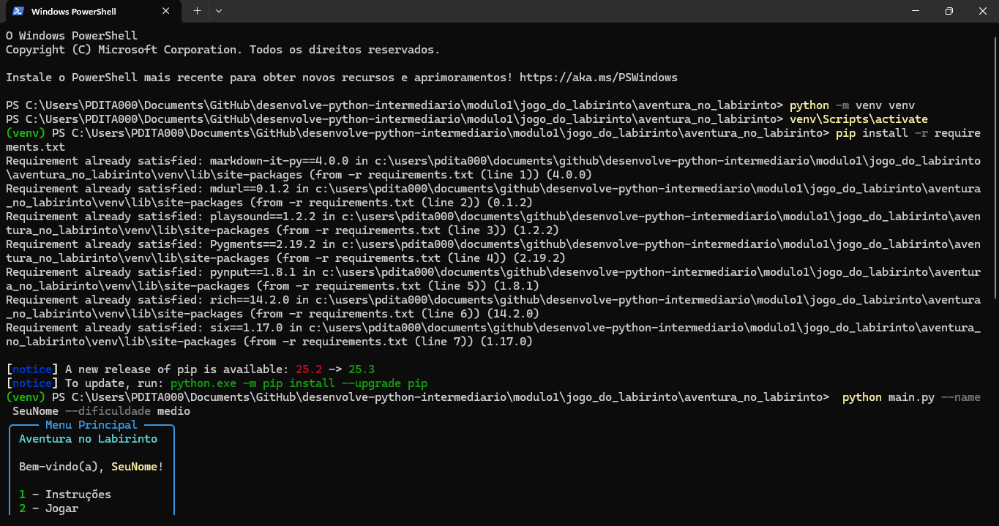
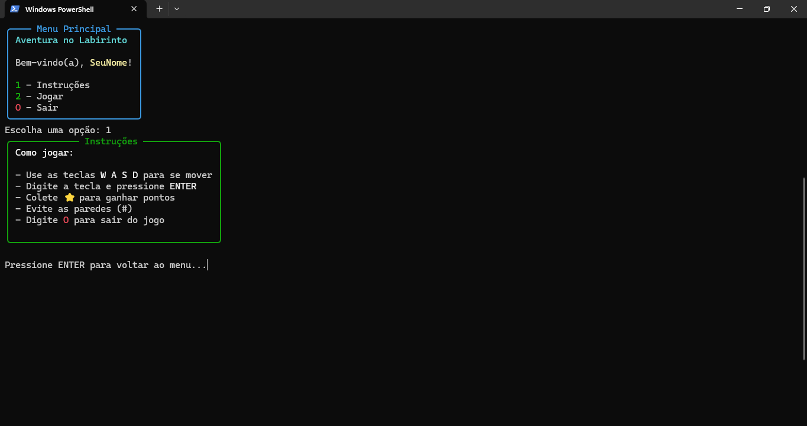
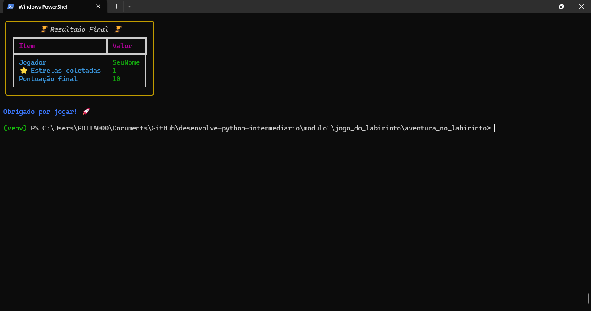

# Aventura no Labirinto
Jogo interativo em terminal, onde você controla um personagem para coletar estrelas ⭐ e evitar obstáculos #.

## Como executar

Crie um ambiente virtual e instale as dependências:

1º passo: No terminal, navegue até a pasta do projeto e crie um ambiente virtual.
2º passo: Digite no terminal
     python -m venv venv
3º passo: Ative o ambiente virtual
    source venv/bin/activate  # Linux / Mac
    venv\Scripts\activate     # Windows
4º passo: Instale as bibliotecas necessárias
    pip install -r requirements.txt
5º passo: Execute o jogo
    python main.py --name SeuNome --dificuldade medio

Opções:
--name <nome>: Nome do jogador (obrigatório)
--dificuldade <facil|medio|dificil>: Define o tamanho do labirinto
--disable-sound: Desativa música de fundo

## Menu e instruções 
Ao entrar no jogo, leia o menu e entre nas instruções pressionando a tecla 1 + Enter. Tecle Enter para voltar ao menu.

## Como jogar
Entre no jogo digitando 2 no menu e pressionando Enter.
Use as teclas W, A, S, D para mover o personagem.
Pressione Enter após digitar a tecla de movimento.
Colete todas as estrelas ⭐ para ganhar pontos.
Evite bater nas paredes #.
Digite a letra "O" para sair do jogo a qualquer momento.

## Fim de jogo
O jogo termina automaticamente quando todas as estrelas ⭐ forem coletadas, mostrando o resultado final.
Você também pode sair a qualquer momento pressionando a letra "O".

## Estrura do Projeto
aventura_no_labirinto/
│
├── aventura_pkg/
│   ├── __init__.py
│   ├── jogador.py      # Movimento e pontuação do jogador
│   ├── labirinto.py    # Criação e impressão do labirinto
│   └── utils.py        # Menu, instruções e tela final
│
├── assets/
│   └── fim.png
│   └── inicializar.png
│   └── instrucoes.png
│   └── jogo.png
│   └── musica_fundo.mp3
│
├── main.py             # Arquivo principal do jogo
└── requirements.txt

## Requisitos
Python 3.9 ou superior
Bibliotecas listadas no requirements.txt:
    rich
    playsound
    pynput
    Pygments
    six
    markdown-it-py
    mdurl

## Observações
A música de fundo só funcionará se o arquivo musica_fundo.mp3 estiver presente na pasta assets.
O jogo foi feito para rodar em terminal/console.
Você pode alterar a cor do jogador (rich) ajustando o parâmetro --color (opcional). 